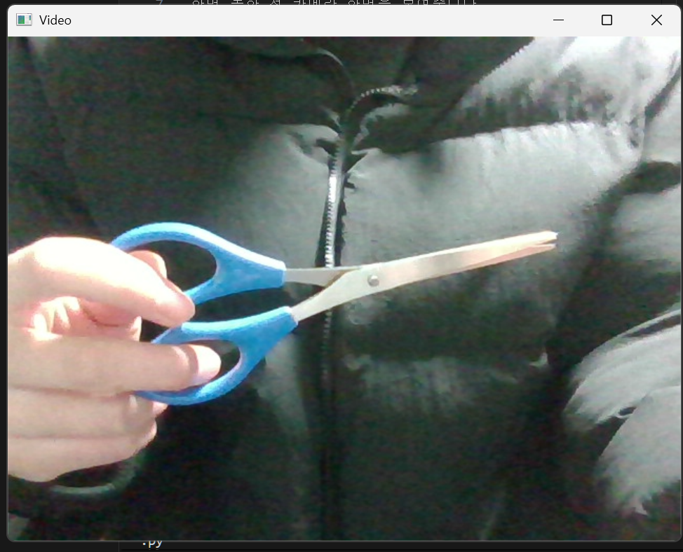
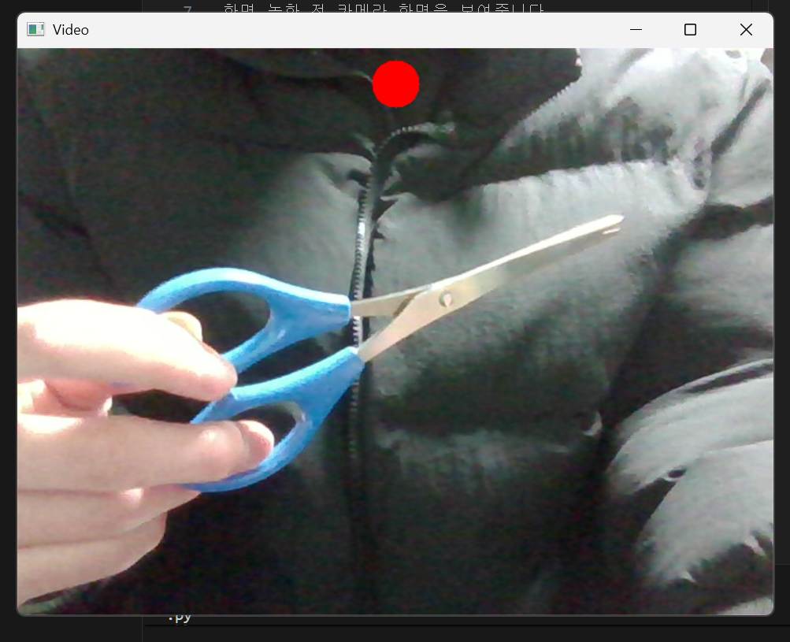
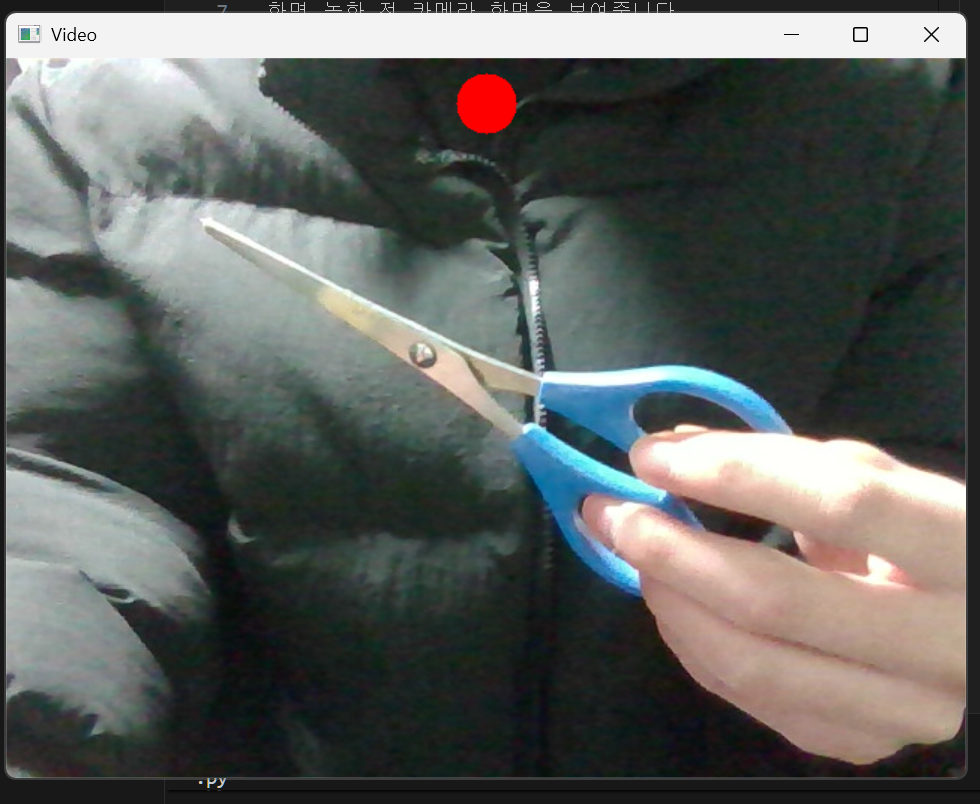
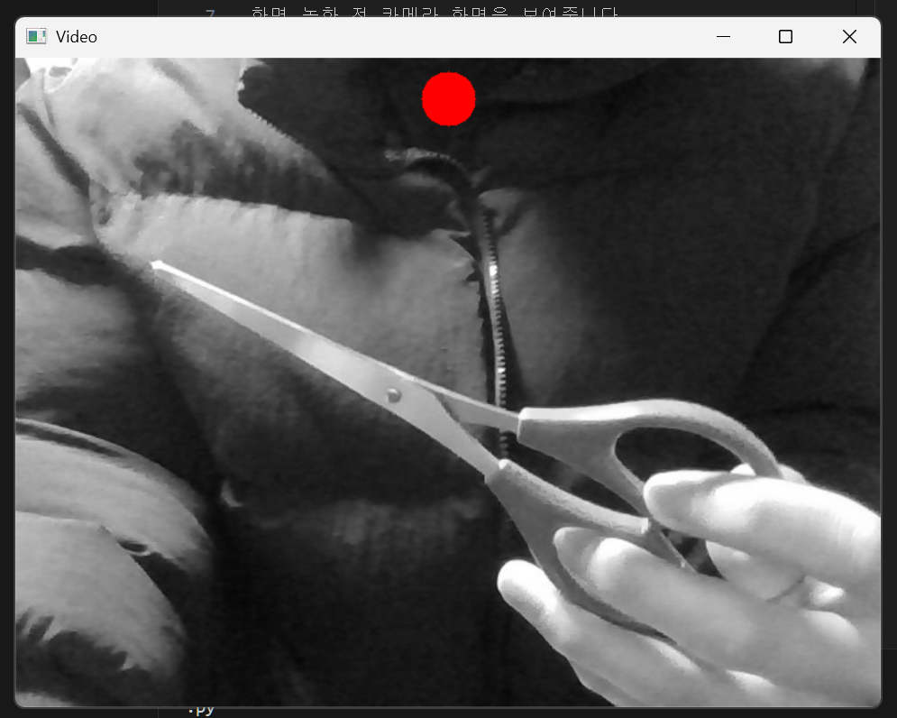

## 프로그램 설명
OpenCV를 활용하여 제작한 간단한 기능들이 들어있는 비디오 레코더 프로그램입니다.
ESC 키를 눌러 프로그램을 종료할 수 있습니다.

## 기능 소개
### 1. Preview 모드
화면 녹화 전 카메라 화면을 보여줍니다.

### 2. Record 모드
Space 키를 눌러 Record 모드를 전환할 수 있습니다.
Record 모드 시 화면 상단에 빨간색 원이 표시되며, 화면이 녹화됩니다.

### 3. Flip 모드
f 키를 눌러 Flip 모드를 전환할 수 있습니다.
화면 녹화 중에도 실시간으로 좌우 반전 효과를 적용할 수 있습니다.

### 4. 흑백 모드
g 키를 눌러 흑백 모드를 전환할 수 있습니다.
화면 녹화 중에도 실시간으로 흑백 화면 효과를 적용할 수 있습니다.
